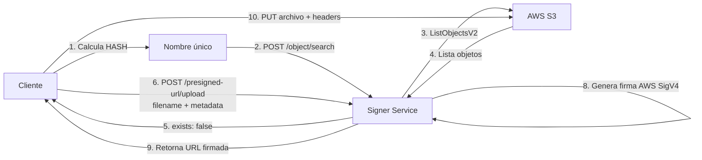

# Signer Service - Documentación Técnica para Claude

## Propósito del Proyecto

Servicio HTTP en Go que genera presigned URLs de AWS S3 con soporte multi-tenancy. Permite que múltiples empresas compartan un bucket S3 de forma segura, donde cada empresa tiene su propio prefijo y credenciales IAM.

## Arquitectura

### Componentes Principales

```
┌─────────────────┐
│ Cliente Backend │
└────────┬────────┘
         │
         │ HTTP REST
         │
┌────────▼────────┐
│ Signer Service  │
│  (Go HTTP API)  │
└────────┬────────┘
         │
         │ AWS SDK v2
         │
┌────────▼────────┐
│    AWS S3       │
│  (aws-muppet)   │
└─────────────────┘
```

### Flujo de Datos



**Ejemplo de path generado:** `addi/inputs/2024-01-16/14-30-00/a3f5b8c9.pdf.gz`

## Estructura del Código

```
signer-service/
├── cmd/
│   └── main.go                    # Entry point, inicia servidor HTTP
├── internal/
│   ├── config/
│   │   └── config.go              # Carga variables de entorno (.env)
│   ├── handler/
│   │   └── handler.go             # HTTP handlers (search, upload)
│   └── service/
│       ├── s3_service.go          # Lógica AWS S3 SDK (ListObjects)
│       └── aws_signer.go          # Firma manual AWS Signature V4
├── Dockerfile                     # Multi-stage build (Alpine)
├── .env.example                   # Template de configuración
├── go.mod                         # Dependencias Go
└── go.sum                         # Checksums de dependencias
```

## Endpoints Implementados

### 1. `GET /health`
- **Propósito:** Health check para Docker/Kubernetes
- **Handler:** `handler.HealthCheck()`
- **Retorna:** `{"status": "healthy", "service": "signer-service"}`

### 2. `POST /api/v1/object/search`
- **Propósito:** Buscar si un archivo (por nombre/hash) existe en el bucket
- **Handler:** `handler.SearchObject()`
- **Lógica:**
  1. Recibe `filename` del cliente
  2. Llama a `s3Service.SearchObjectByFilename()`
  3. Ejecuta `ListObjectsV2` con prefijo de empresa
  4. Busca coincidencia por nombre al final de cada key
  5. Retorna `exists: true/false` y `object_key` si existe
- **Request:** `{"filename": "a3f5b8c9d2e1.tar.gz"}`
- **Response:** `{"exists": bool, "filename": string, "object_key"?: string}`

### 3. `POST /api/v1/presigned-url/upload`
- **Propósito:** Generar presigned URL para subir archivo a S3 con metadatos personalizados
- **Handler:** `handler.GeneratePutURL()`
- **Lógica:**
  1. Recibe `filename`, `content_type` (opcional) y `metadata` (opcional)
  2. **Construye automáticamente la ruta** con timestamp: `inputs/YYYY-MM-DD/HH-MM-SS/filename`
  3. Llama a `s3Service.GeneratePresignedPutURL()`
  4. Agrega automáticamente `COMPANY_PREFIX` al path completo
  5. Usa **firma manual AWS Signature V4** (`aws_signer.go`)
  6. **Incluye metadatos personalizados en la firma** como headers `x-amz-meta-*`
  7. Genera presigned URL válida por el tiempo configurado
  8. Retorna URL firmada temporal
- **Request (sin metadatos):**
  ```json
  {
    "filename": "document-hash-abc123.pdf.gz",
    "content_type": "application/gzip"
  }
  ```
  **Resultado:** S3 path será `{COMPANY_PREFIX}/inputs/2024-01-16/14-30-00/document-hash-abc123.pdf.gz`

- **Request (con metadatos):**
  ```json
  {
    "filename": "cv-xyz789.pdf.gz",
    "content_type": "application/gzip",
    "metadata": {
      "language": "es",
      "instructions": "procesar con OCR"
    }
  }
  ```
  **Resultado:** S3 path será `{COMPANY_PREFIX}/inputs/2024-01-16/14-30-00/cv-xyz789.pdf.gz`

- **Response:** `{"url": "https://aws-muppet.s3.us-east-1.amazonaws.com/addi/inputs/2024-01-16/14-30-00/...", "expires_in": "configured expiration time"}`
- **Notas importantes:**
  - El **cliente solo envía el nombre del archivo**, el servidor construye la ruta completa con timestamp (UTC)
  - Estructura automática: `{COMPANY_PREFIX}/inputs/{fecha}/{hora}/{filename}`
  - Fecha en formato: `YYYY-MM-DD` (ej: `2024-01-16`)
  - Hora en formato: `HH-MM-SS` (ej: `14-30-00`)
  - El `content_type` NO se incluye en la URL, debe enviarse como header en la petición PUT
  - Los **metadatos DEBEN enviarse como headers** en la petición PUT: `x-amz-meta-language`, `x-amz-meta-instructions`, etc.
  - Si se especifican metadatos en el request, son **obligatorios** en el PUT (forman parte de la firma)
  - Los nombres de metadatos se convierten automáticamente a lowercase y se prefijan con `x-amz-meta-`

## Configuración Multi-Tenancy

### Variables de Entorno Clave

```env
AWS_ACCESS_KEY_ID=xxx              # Credenciales IAM específicas por empresa
AWS_SECRET_ACCESS_KEY=xxx
S3_BUCKET_NAME=aws-muppet          # Bucket compartido
COMPANY_PREFIX=addi                # Prefijo único por empresa (ej: addi, sourcing)
PRESIGNED_URL_EXPIRATION_MINUTES=3 # TTL de presigned URLs
```

### Seguridad por Diseño

1. **Aislamiento por Prefijo:**
   - Cada empresa tiene `COMPANY_PREFIX` único (ej: `addi/`, `sourcing/`)
   - El código agrega automáticamente el prefijo:
     ```go
     func buildObjectKey(objectKey string) string {
         return fmt.Sprintf("%s/%s", s.companyPrefix, objectKey)
     }
     ```
   - Cliente envía: `"backups/file.tar.gz"`
   - Ruta real en S3: `addi/backups/file.tar.gz`

2. **Políticas IAM Restrictivas:**
   - Cada empresa tiene **usuario IAM separado**
   - Permisos limitados **solo a su prefijo**
   - Ejemplo para empresa "addi":
     ```json
     {
       "Statement": [
         {
           "Action": ["s3:PutObject"],
           "Resource": "arn:aws:s3:::aws-muppet/addi/*"
         },
         {
           "Action": ["s3:ListBucket"],
           "Resource": "arn:aws:s3:::aws-muppet",
           "Condition": {
             "StringLike": {"s3:prefix": ["addi/*"]}
           }
         }
       ]
     }
     ```

3. **Imposibilidad de Escape:**
   - Cliente NO puede acceder a otros prefijos
   - AWS IAM rechaza cualquier operación fuera del prefijo
   - El código garantiza que el prefijo siempre se agrega

## Dependencias Go

```go
github.com/aws/aws-sdk-go-v2/config          // Configuración AWS
github.com/aws/aws-sdk-go-v2/service/s3      // Cliente S3
github.com/aws/aws-sdk-go-v2/credentials     // Credenciales estáticas
github.com/joho/godotenv                     // Carga .env
github.com/gorilla/mux                       // Router HTTP
```

## Decisiones de Diseño

### ¿Por qué firma manual en lugar del SDK de AWS?
- **Control total:** Evita problemas de codificación de URL con diferentes clientes HTTP
- **Compatibilidad:** Funciona correctamente con Spring RestTemplate que re-codifica URLs
- **Dos métodos de generación:**
  - `buildCanonicalQueryString()`: Para calcular la firma (con barras codificadas `%2F`)
  - `buildFinalQueryString()`: Para la URL final (sin codificar barras en credential)
- **Problema resuelto:** AWS SDK generaba URLs que Spring doble-codificaba, causando errores de firma

### ¿Por qué NO hay presigned URL para GET?
- El cliente **solo sube archivos**, no descarga
- Solo necesita: buscar existencia + subir si no existe

### ¿Por qué ListBucket en lugar de HeadObject?
- Los archivos tienen HASH como nombre único
- Pueden estar en diferentes carpetas por fecha: `backups/2024-01-15/hash.tar.gz`
- Cliente solo conoce el HASH, no la ruta completa
- Necesita buscar en **todo el prefijo de la empresa**

### ¿Por qué Multi-Tenancy con múltiples instancias?
- **Seguridad:** Aislamiento total de credenciales AWS
- **Escalabilidad:** Cada empresa puede escalar independientemente
- **Configuración:** Cada empresa puede tener TTL diferente

## Despliegue Docker

### Dockerfile Multi-Stage
1. **Build stage:** Compila binario Go estático
2. **Runtime stage:** Alpine Linux mínimo (~20MB)
3. **Seguridad:** Usuario no-root, healthcheck integrado

### Docker Compose Multi-Empresa
```yaml
signer-service-addi:    # Puerto 8081
signer-service-sourcing: # Puerto 8082
```
Cada instancia:
- Credenciales AWS únicas
- `COMPANY_PREFIX` diferente
- Puerto expuesto único

## Testing y Validación

### Verificar funcionamiento básico:
```bash
# 1. Health check
curl http://localhost:8080/health

# 2. Buscar archivo
curl -X POST http://localhost:8080/api/v1/object/search \
  -H "Content-Type: application/json" \
  -d '{"filename": "test.tar.gz"}'

# 3. Obtener presigned URL (sin metadatos)
# El servidor creará automáticamente la ruta: inputs/2024-01-16/14-30-00/test.tar.gz
curl -X POST http://localhost:8080/api/v1/presigned-url/upload \
  -H "Content-Type: application/json" \
  -d '{"filename": "test.tar.gz", "content_type": "application/gzip"}'
```

### Usar presigned URLs con metadatos personalizados:

#### 1. Solicitar presigned URL con metadatos:
```bash
# El servidor creará automáticamente: inputs/2024-01-16/14-30-00/cv_123.pdf.gz
curl -X POST http://localhost:8080/api/v1/presigned-url/upload \
  -H "Content-Type: application/json" \
  -d '{
    "filename": "cv_123.pdf.gz",
    "content_type": "application/gzip",
    "metadata": {
      "language": "es",
      "instructions": "extract text with OCR"
    }
  }'
```

**Respuesta:**
```json
{
  "url": "https://aws-muppet.s3.us-east-1.amazonaws.com/addi/inputs/2024-01-16/14-30-00/cv_123.pdf.gz?X-Amz-Algorithm=AWS4-HMAC-SHA256&X-Amz-SignedHeaders=host;x-amz-meta-instructions;x-amz-meta-language&...",
  "expires_in": "configured expiration time"
}
```

#### 2. Subir archivo usando la presigned URL (con los metadatos firmados):
```bash
# IMPORTANTE: Los headers de metadatos DEBEN coincidir exactamente con los especificados en el request
curl -X PUT "<presigned-url-from-previous-step>" \
  -H "Content-Type: application/gzip" \
  -H "x-amz-meta-language: es" \
  -H "x-amz-meta-instructions: extract text with OCR" \
  --data-binary @cv_123.pdf.gz
```

#### 3. Verificar metadatos almacenados en S3:
```bash
# Usando AWS CLI (ajustar la fecha/hora según cuando se subió)
aws s3api head-object \
  --bucket aws-muppet \
  --key addi/inputs/2024-01-16/14-30-00/cv_123.pdf.gz
```

**Salida esperada:**
```json
{
  "Metadata": {
    "language": "es",
    "instructions": "extract text with OCR"
  },
  "ContentType": "application/gzip",
  ...
}
```

### Errores comunes con metadatos:

#### SignatureDoesNotMatch al subir con metadatos
**Causa:** Los headers enviados en el PUT no coinciden con los firmados
**Solución:** Verificar que:
- Los nombres de headers sean exactamente `x-amz-meta-<key>` (lowercase)
- Los valores sean idénticos a los especificados en el request original
- NO olvidar ningún header de metadato
- NO agregar headers de metadato que no fueron firmados

**Ejemplo incorrecto:**
```bash
# Request: metadata: {"language": "es", "instructions": "ocr"}
# PUT: solo envía x-amz-meta-language (falta instructions) ❌
```

**Ejemplo correcto:**
```bash
# Request: metadata: {"language": "es", "instructions": "ocr"}
# PUT: envía ambos headers exactamente ✅
curl -X PUT "url" \
  -H "x-amz-meta-language: es" \
  -H "x-amz-meta-instructions: ocr"
```

## Troubleshooting Común

### Error 403 en ListBucket
**Causa:** Política IAM incorrecta
**Solución:** `s3:ListBucket` debe aplicarse al bucket (sin `/*`), usar `Condition` con `s3:prefix`

### COMPANY_PREFIX is required
**Causa:** Falta variable en `.env`
**Solución:** Agregar `COMPANY_PREFIX=nombre-empresa`

### Presigned URL expirada
**Causa:** TTL muy corto o URL antigua
**Solución:** Aumentar `PRESIGNED_URL_EXPIRATION_MINUTES` o regenerar URL

### SignatureDoesNotMatch (Error 403)
**Causa:** Desajuste entre firma calculada y esperada por AWS
**Solución:** Verificar que:
- Las credenciales AWS sean correctas y válidas
- La región en `.env` coincida con la del bucket
- El canonical request se construya correctamente
- Nota: Este error fue resuelto implementando firma manual personalizada

### AuthorizationQueryParametersError (Error 400)
**Causa:** Parámetro `X-Amz-Credential` mal formateado (doble codificación)
**Solución:** Ya resuelto con `buildFinalQueryString()` que NO codifica barras en credential

## Notas Importantes para IA

1. **Este servicio NO descarga archivos**, solo genera firmas para subir y busca existencia
2. **Estructura de carpetas AUTOMÁTICA**: El servidor construye la ruta `inputs/{fecha}/{hora}/{filename}` automáticamente
   - Cliente solo envía `filename` (nombre del archivo)
   - Servidor agrega timestamp UTC en formato `YYYY-MM-DD/HH-MM-SS`
   - Path final: `{COMPANY_PREFIX}/inputs/2024-01-16/14-30-00/archivo.pdf.gz`
3. **COMPANY_PREFIX se agrega automáticamente**, el cliente no debe incluirlo
4. **Políticas IAM son críticas**: `ListBucket` al bucket, `PutObject` a objetos
5. **Multi-tenancy por instancias separadas**, no por lógica de autenticación interna
6. **Archivos identificados por HASH**, pueden estar en cualquier carpeta dentro del prefijo
7. **Firma manual AWS Signature V4**: Implementación personalizada en `aws_signer.go` basada en especificación de AWS
8. **Doble método de query string**: Uno para firma (con encoding) y otro para URL final (sin encoding de barras)
9. **Content-Type NO va en query params**: Solo se usa para logging, el cliente debe enviarlo como header
10. **Compatible con clientes HTTP que re-codifican**: Diseñado para trabajar con Spring RestTemplate
11. **Soporte de metadatos personalizados**:
    - Se especifican en el request JSON como `metadata: {"key": "value"}`
    - Se convierten automáticamente a headers `x-amz-meta-key` (lowercase)
    - Se incluyen en la firma AWS Signature V4 como signed headers
    - El cliente DEBE enviar exactamente los mismos headers al hacer PUT
    - Los metadatos se almacenan permanentemente en S3 con el objeto
12. **Headers firmados dinámicos**: El `X-Amz-SignedHeaders` incluye `host` + todos los metadatos (ordenados alfabéticamente)
13. **Organización temporal automática**: Archivos organizados por fecha/hora de llegada al servicio, facilita auditoría y limpieza de datos antiguos

## Casos de Uso

### Cliente Backend (típico - sin metadatos):
1. Recibe archivo para backup
2. Calcula SHA256 → `a3f5b8c9d2e1.tar.gz`
3. Pregunta a signer-service si existe
4. Si NO existe:
   - Envía solo el nombre del archivo: `a3f5b8c9d2e1.tar.gz`
   - Servidor construye automáticamente: `inputs/2024-01-16/14-30-00/a3f5b8c9d2e1.tar.gz`
   - Recibe presigned URL
   - Sube archivo directamente a S3
5. Si existe: no hace nada (deduplicación)

**Path final en S3:** `{COMPANY_PREFIX}/inputs/{fecha}/{hora}/{hash}.tar.gz`

### Procesamiento de documentos con metadatos:
1. Cliente recibe documento PDF para procesar (ej: CV)
2. Extrae información: idioma, instrucciones de procesamiento
3. Calcula hash del archivo → `f7a3e8b2.pdf.gz`
4. Pregunta a signer-service si existe
5. Si NO existe:
   - Solicita presigned URL **con metadatos** (solo envía filename):
     ```json
     {
       "filename": "f7a3e8b2.pdf.gz",
       "content_type": "application/gzip",
       "metadata": {
         "language": "es",
         "instructions": "extract text with OCR"
       }
     }
     ```
   - Servidor construye automáticamente: `inputs/2024-01-16/14-30-00/f7a3e8b2.pdf.gz`
   - Recibe presigned URL firmada (incluye metadatos en la firma)
   - Sube archivo a S3 con los headers de metadatos:
     ```
     PUT <presigned-url>
     Content-Type: application/gzip
     x-amz-meta-language: es
     x-amz-meta-instructions: extract text with OCR
     ```
6. Servicio de procesamiento posterior puede:
   - Leer metadatos desde S3 sin descargar el archivo
   - Decidir qué procesamiento aplicar según `instructions`
   - Usar el idioma correcto para OCR según `language`

**Path final en S3:** `{COMPANY_PREFIX}/inputs/2024-01-16/14-30-00/f7a3e8b2.pdf.gz`

## Mejoras Futuras Potenciales

- [ ] Paginación en ListObjects (si hay >1000 archivos)
- [ ] Cache de búsquedas recientes (Redis)
- [ ] Métricas con Prometheus
- [ ] Rate limiting por empresa
- [ ] Presigned URL para DELETE (si se requiere)
- [ ] Soporte para búsqueda por prefijo parcial
