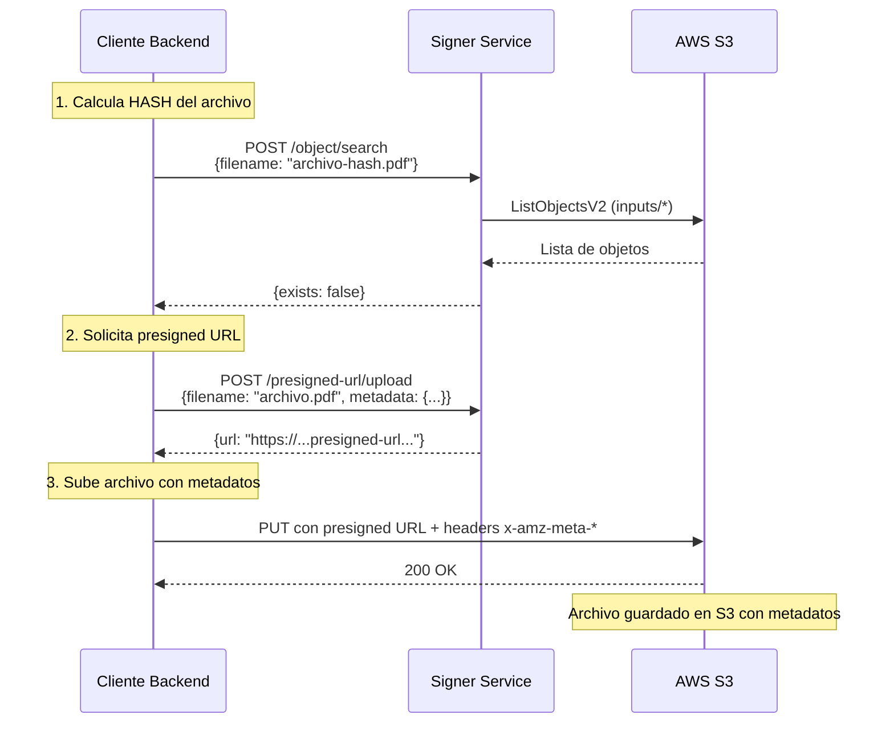

# Signer Service - AWS S3 Presigned URL Generator

Servicio HTTP que genera presigned URLs de AWS S3 con soporte para metadatos personalizados. Permite a clientes subir archivos PDF a S3 incluyendo metadatos como idioma e instrucciones de procesamiento.

## Características

- ✅ Generación de presigned URLs para subir archivos (PUT)
- ✅ Soporte para metadatos personalizados en headers x-amz-meta-*
- ✅ Búsqueda de archivos por nombre en el bucket
- ✅ Estructura automática de rutas con timestamp (inputs/YYYY-MM-DD/HH-MM-SS/)
- ✅ Firma manual AWS Signature V4 para compatibilidad con diferentes clientes HTTP
- ✅ Seguridad garantizada por políticas IAM de AWS
- ✅ Contenedor Docker listo para producción
- ✅ Health check endpoint

## Flujo de Operación



## Endpoints

### 1. Health Check
```http
GET /health
```

**Respuesta:**
```json
{
  "status": "healthy",
  "service": "signer-service"
}
```

---

### 2. Buscar Archivo por Nombre

```http
POST /api/v1/object/search
Content-Type: application/json

{
  "filename": "archivo-hash-abc123.pdf"
}
```

**Respuesta si existe:**
```json
{
  "exists": true,
  "filename": "archivo-hash-abc123.pdf",
  "object_key": "inputs/2024-01-15/14-30-00/archivo-hash-abc123.pdf"
}
```

**Respuesta si NO existe:**
```json
{
  "exists": false,
  "filename": "archivo-hash-abc123.pdf"
}
```

---

### 3. Generar Presigned URL para Subir Archivo

**Sin metadatos:**
```http
POST /api/v1/presigned-url/upload
Content-Type: application/json

{
  "filename": "archivo-clean.pdf",
  "content_type": "application/pdf"
}
```

**Con metadatos personalizados:**
```http
POST /api/v1/presigned-url/upload
Content-Type: application/json

{
  "filename": "archivo-clean.pdf",
  "content_type": "application/pdf",
  "metadata": {
    "language": "es",
    "instructions": "Instrucciones personalizadas para el procesamiento",
    "user_email": "usuario@example.com"
  }
}
```

**Respuesta:**
```json
{
  "url": "https://cv-processor-dev.s3.us-east-1.amazonaws.com/inputs/2025-11-24/02-21-42/archivo-clean.pdf?X-Amz-Algorithm=AWS4-HMAC-SHA256&X-Amz-Credential=...&X-Amz-SignedHeaders=host%3Bx-amz-meta-instructions%3Bx-amz-meta-language",
  "expires_in": "configured expiration time"
}
```

**Uso con metadatos:**
```bash
curl -X PUT 'PRESIGNED_URL' \
  --header 'Content-Type: application/pdf' \
  --header 'x-amz-meta-language: es' \
  --header 'x-amz-meta-instructions: Instrucciones personalizadas...' \
  --header 'x-amz-meta-user-email: usuario@example.com' \
  --data-binary '@archivo-clean.pdf'
```

**Nota importante:** Si especificas metadatos en la petición, DEBES incluir los headers `x-amz-meta-*` correspondientes al hacer el PUT, ya que forman parte de la firma.

---

## Configuración

### Variables de Entorno

```env
# AWS Configuration
AWS_REGION=us-east-1
AWS_ACCESS_KEY_ID=your-access-key-id
AWS_SECRET_ACCESS_KEY=your-secret-access-key

# S3 Configuration
S3_BUCKET_NAME=cv-processor-dev

# Company/Tenant Configuration (opcional para multi-tenancy)
COMPANY_PREFIX=

# Presigned URL Configuration
PRESIGNED_URL_EXPIRATION_MINUTES=15

# Server Configuration
PORT=8081
```

### Política IAM Requerida

Para subir archivos a S3:

```json
{
  "Version": "2012-10-17",
  "Statement": [
    {
      "Effect": "Allow",
      "Action": ["s3:PutObject"],
      "Resource": "arn:aws:s3:::cv-processor-dev/*"
    },
    {
      "Effect": "Allow",
      "Action": ["s3:ListBucket"],
      "Resource": "arn:aws:s3:::cv-processor-dev"
    }
  ]
}
```

**⚠️ Importante:**
- `s3:ListBucket` se aplica al **bucket** (sin `/*`)
- `s3:PutObject` se aplica a los **objetos** (con `/*`)
- Si usas `COMPANY_PREFIX`, agrega condiciones `s3:prefix` para multi-tenancy

---

## Instalación y Ejecución

### Con Go Local

```bash
# Instalar dependencias
go mod download

# Configurar variables de entorno
cp .env.example .env
# Editar .env con tus credenciales

# Ejecutar
go run cmd/main.go
```

### Con Docker

```bash
# Construir imagen
docker build -t signer-service:latest .

# Ejecutar
docker run -d \
  --name signer-service \
  -p 8080:8080 \
  --env-file .env \
  signer-service:latest
```

### Con Docker Compose

```yaml
version: '3.8'

services:
  signer-service:
    build: ./signer-service
    ports:
      - "8081:8080"
    environment:
      - AWS_REGION=us-east-1
      - AWS_ACCESS_KEY_ID=${AWS_ACCESS_KEY_ID}
      - AWS_SECRET_ACCESS_KEY=${AWS_SECRET_ACCESS_KEY}
      - S3_BUCKET_NAME=cv-processor-dev
      - COMPANY_PREFIX=
      - PRESIGNED_URL_EXPIRATION_MINUTES=15
```

---

## Estructura de Archivos en S3

### Organización Automática

```
cv-processor-dev/
└── inputs/
    └── 2025-11-24/
        ├── 02-21-42/
        │   └── archivo-clean.pdf     # Archivo subido con metadatos
        └── 02-27-55/
            └── archivo-clean.pdf
```

### Generación de Rutas

1. **Cliente envía:** Solo el nombre del archivo (`filename: "archivo.pdf"`)
2. **Signer-service genera:** Ruta completa con timestamp UTC
3. **Formato:** `inputs/YYYY-MM-DD/HH-MM-SS/filename.pdf`
4. **Ejemplo:** `inputs/2025-11-24/02-21-42/archivo.pdf`

### Metadatos Soportados

El servicio permite agregar cualquier metadato personalizado que se almacenará como headers `x-amz-meta-*` en S3:

- **language:** Idioma del archivo
- **instructions:** Instrucciones de procesamiento
- **user_email:** Email del usuario que sube el archivo
- **Cualquier clave personalizada:** Se convierte automáticamente a `x-amz-meta-clave`

---

## Estructura del Proyecto

```
signer-service/
├── cmd/
│   └── main.go                # Punto de entrada
├── internal/
│   ├── config/
│   │   └── config.go          # Configuración
│   ├── handler/
│   │   └── handler.go         # HTTP handlers
│   └── service/
│       └── s3_service.go      # Lógica S3
├── Dockerfile
├── .env.example
├── .gitignore
├── go.mod
└── README.md
```

---

## Troubleshooting

### Error: "AccessDenied: User is not authorized to perform: s3:ListBucket"

**Causa:** La política IAM está mal configurada.

**Solución:** Asegúrate que `s3:ListBucket` se aplica al bucket (sin `/*`):

```json
{
  "Action": ["s3:ListBucket"],
  "Resource": "arn:aws:s3:::cv-processor-dev",  // ✅ Sin /*
  "Condition": {
    "StringLike": {
      "s3:prefix": ["addi/*"]
    }
  }
}
```

### Error: "SignatureDoesNotMatch" con metadatos

**Causa:** Los headers de metadatos no coinciden con los especificados en la presigned URL.

**Solución:** Asegúrate de enviar exactamente los headers `x-amz-meta-*` que especificaste en la petición de la presigned URL.

### Error: Presigned URL expirada

**Causa:** La URL tiene un tiempo de expiración configurado (por defecto 3 minutos)

**Solución:** Ajusta `PRESIGNED_URL_EXPIRATION_MINUTES` o genera una nueva URL

---

## Licencia

MIT
